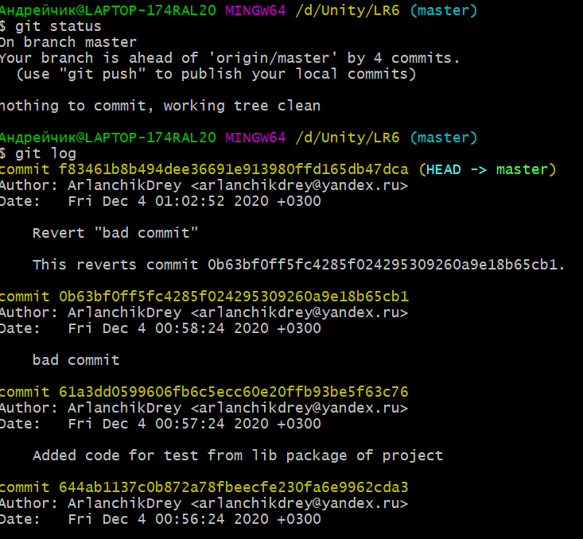
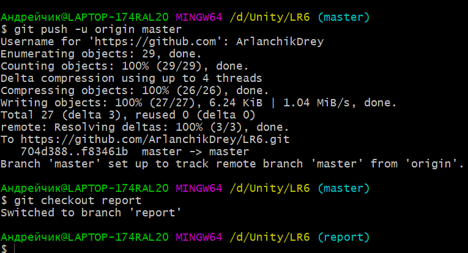

# Отчёт
## Цель работы
изучение  базовых  возможностей  системы управления версиями, опыт работы с Git Api, опыт работы с локальным и удаленным репозиторием.

## Лог команд
	git clone https://github.com/ArlanchikDrey/LR6
	git pull
	git log
	git merge branch1
	git commit
	git branch -d branch1
	git add widget_test.dart
	git commit
	git add lib
	git commit
	git add README.md
	git commit
	git revert 0b63bf0
	git push
	git checkout -b report
	git add .
	git commit
	git push
	git add README.md
	git commit
	git push

## Скриншоты

## Вывод
Получены базовые навыки работы с системой контроля версий Git и хостингом исходного кода GitHub.

## История операций
* 3b926a2 2020-12-04 | screenshots after revert commit (HEAD -> report, origin/report) [ArlanchikDrey]
* f83461b 2020-12-04 | Revert "bad commit" (origin/master, origin/HEAD, master) [ArlanchikDrey]
* 0b63bf0 2020-12-04 | bad commit [ArlanchikDrey]
* 61a3dd0 2020-12-04 | Added code for test from lib package of project [ArlanchikDrey]
* 644ab11 2020-12-04 | Added example test of dart code [ArlanchikDrey]
*   704d388 2020-12-04 | Merge branch 'branch1' [ArlanchikDrey]
|\
| * 0f9f50d 2020-11-21 | Заполнил файл (origin/branch1) [Kurtyanik]
* | a5948fc 2020-11-30 | Create File [ArlanchikDrey]
* | 921f53b 2020-11-21 | Обновление информации [Kurtyanik]
|/
* c08a654 2020-11-21 | Файл создан пустым [Kurtyanik]
* 3c6e913 2020-11-21 | Initial commit [Kurtyanik]
